# JTP Technical Project - Product Recommendation System

## Table of Contents

- [Overview](#overview) : A brief description summarizing the project's content.
- [Dataset](#dataset) : Details about the dataset used in the project.
- [Technology Stack](#technology-stack) : An overview of the technologies and tools implemented.
- [Approaches](#approaches) : A description of all methods explored, along with justifications for choosing the specific technology stack.
- [Workflow](#workflow) : The workflow diagram and a summary of the steps taken throughout the project.
- [Train](#train) : Instruction on training the model.
- [Installation Manual](#installation-manual) : Steps to run the project on your local system.
- [User Manual](#user-manual) : Visuals showcasing the application's interface and features.

## Overview

In everyday e-commerce applications, users receive product recommendations based on their activity and browsing history. Inspired by this, the project aims to develop a product recommendation system that suggests visually similar products based on an uploaded image. Using machine learning techniques such as image feature extraction and similarity matching, the system offers a personalized and intuitive shopping experience. It also tracks previous recommendations, making it easy for users to revisit or continue their search.

## Dataset

This system is trained on a dataset sourced from Kaggle, consisting of 44,000 images. The dataset is accessible here: [Fashion Product Images Dataset](https://www.kaggle.com/datasets/paramaggarwal/fashion-product-images-dataset) . The dataset also includes metadata such as product links, names, and multiple category labels, serving as the foundation for training the model.

## Technology Stack

### Frontend:

- **React.js**: For building the user interface.
- **Axios**: For making HTTP requests from the frontend to the backend.
- **CORS**: Configured to allow secure communication between the frontend and the backend.
- **Framer Motion**: For adding smooth animations and transitions to the UI.
- **React Router DOM**: For handling dynamic routing in the React application.

### Backend:

- **Flask**: A Lightweight Python framework used for building the API.
- **TensorFlow / Keras**: For training the autoencoder model used in feature extraction.
- **Cosine Similarity**: Used to compute similarity between feature vectors.

### Database:

- **MongoDB Atlas**: Cloud-hosted NoSQL database to store user data and recommendation history.

### Deployment:

- **Docker**: For containerizing the application to ensure smooth deployment across environments.

## Approaches

[View approaches](./assets/AUTOENCODER.md)

## Workflow

<p align="center">
  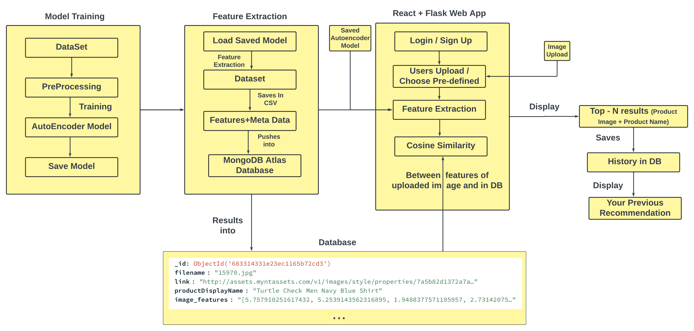
</p>

[Read further](./assets/FLOWCHART.md)

## Train

> Note: Make sure to download the [dataset](https://www.kaggle.com/datasets/paramaggarwal/fashion-product-images-dataset) and update the file paths to avoid errors and ensure correctness. Install the [requirements](backend/requirements.txt) to run the notebooks.

1. **Dataset Preparation**:\
   Utilize the [preprocessing.ipynb](preprocessing.ipynb) notebook handles dataset preparation by cleaning and filtering the metadata CSV, performing stratified splitting into train and test sets, and copying the corresponding images into separate folders for training and testing.
2. **Training**:\
   The [model_training.ipynb](model_training.ipynb) notebook trains an autoencoder on the image dataset by constructing encoder-decoder networks, feeding images through generators, saving the trained model, and plotting the training loss.
3. **Feature Extraction**:\
   The [feature_extraction.py](feature_extraction.py) script loads the trained autoencoder model, extracts image features by encoding resized images, and saves the extracted features along with metadata into a CSV file.
4. **Pushing Features into Database**:\
   The [db_push.py](backend/db_push.py) script reads the feature CSV and inserts the data into a MongoDB collection using the connection URI stored in .env file.
5. **Test Model**:\
   The [test_model.ipynb](test_model.ipynb) notebook loads the trained encoder model, preprocesses an input image, computes its feature vector, then compares it with pre-extracted features from a CSV using cosine similarity to recommend and display the top similar products

> Connect to MongoDB Atlas, update the network access settings, and copy the connection string. Store the connection string in a .env file to ensure seamless backend execution.

## Installation Manual

> **Prerequisites:** Docker installed on your machine, and a basic understanding of Docker and terminal commands.

### 1. Repository Cloning: Execute the following command to clone the repository.
- Open a new empty folder in VSCode, then open the terminal (within VSCode or your system terminal) and run the following command:

```bash
git clone -b main https://github.com/MayurJadhav13/JTP-Technical-Project
```

### 2. Application Startup

Navigate to the project directory:

```bash
cd JTP-Technical-Project/
```
> ⚠️ Database Configuration: The .env file required for connecting to MongoDB Atlas has been shared via email. Please place the .env file in the backend folder. Your .env file path should look like this: backend/.env

Launch the application by loading the saved model and embeddings with Docker:
> Ensure Docker Desktop is running.
```bash
docker-compose up --build
```
or
```bash
docker compose up --build
```
Just type http://localhost:3000 in your browser and the application will open.
Use the images from the [sample_images](sample_images) folder to get recommendations.
- Wait for a couple of seconds after uploading an image to receive the recommendation.

### 3. Close The Application
- To logout from the current session, use the Logout option in the user profile. Then, return to the terminal window and press 'Ctrl + C' to stop the system.

## User Manual

<h3>Signup Page</h3>
New users can register by providing a username, email address, and a secure password.
<p align="center">
  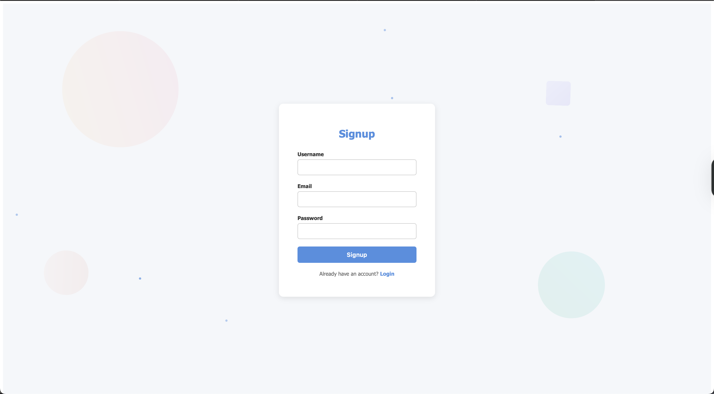
</p>
<h3>Login Page</h3>
Registered users can log in using their email and password to access their account and previous activity.
<p align="center">
  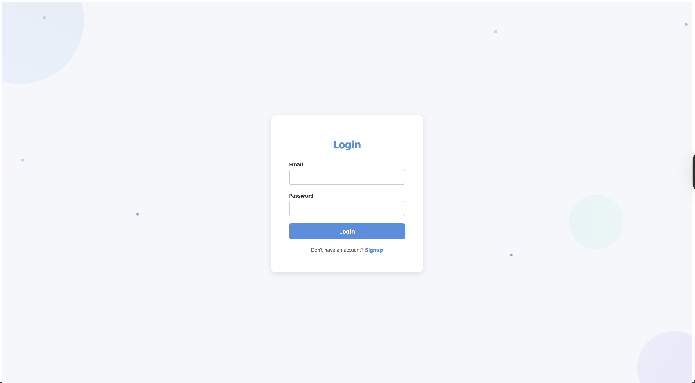
</p>
<h3>Home screen (New User)</h3>
After logging in, new users are directed to the home screen, where they can upload an image to get product recommendations. A user profile section is also accessible.
<p align="center">
  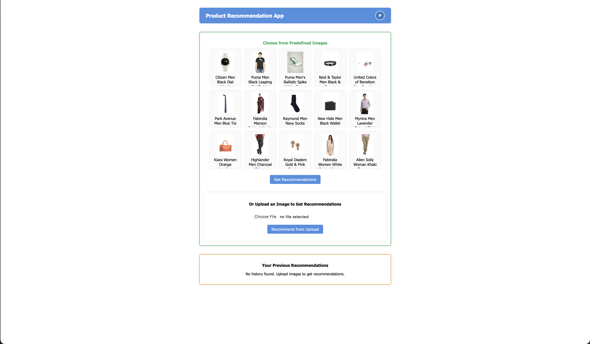
</p>
<h3>Home screen (Existing User)</h3>
Returning users will see the same home screen, but with their past recommendations displayed for quick access and continued browsing.
<p align="center">
  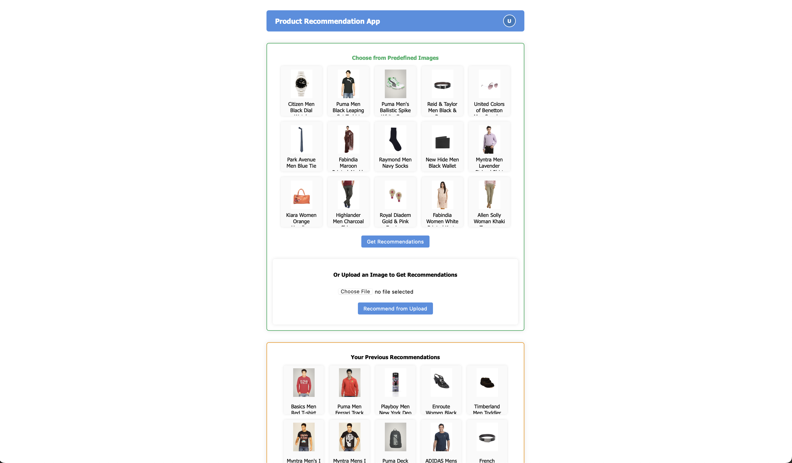
</p>
<h3>Get Recommendations</h3>

(a) Upload an image from the [sample_images](sample_images) folder provided in the repository and click on the Get Recommendations button.
<p align="center">
  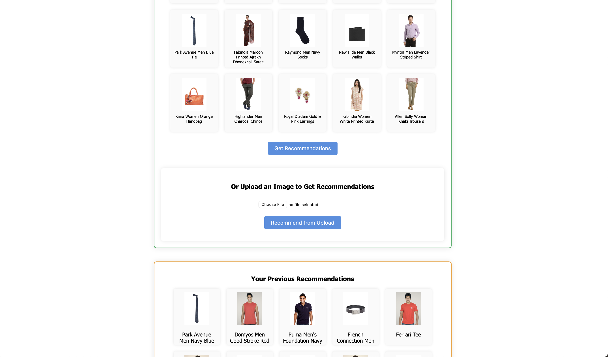
</p>
<p>(b) Choose from a set of predefined images available in the application to quickly test the recommendation system.</p>
<p align="center">
  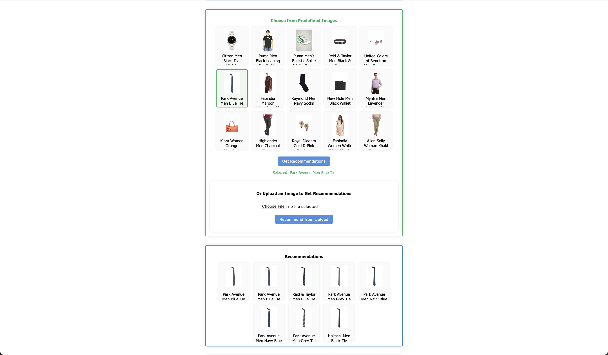
</p>
<h3>View the product</h3>
Clicking on a recommended product opens a pop-out window with more details about that product.
<p align="center">
  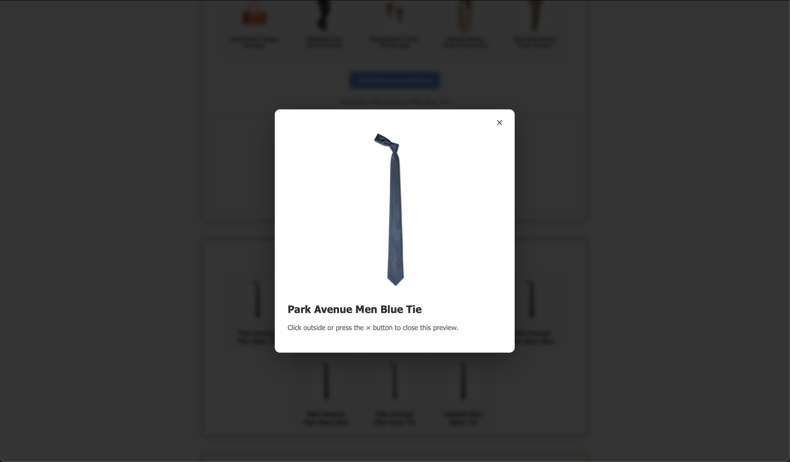
</p>
<h3>User Profile</h3>
The profile section displays the username, a history of previously searched and recommended products, and includes a logout option.
<p align="center">
  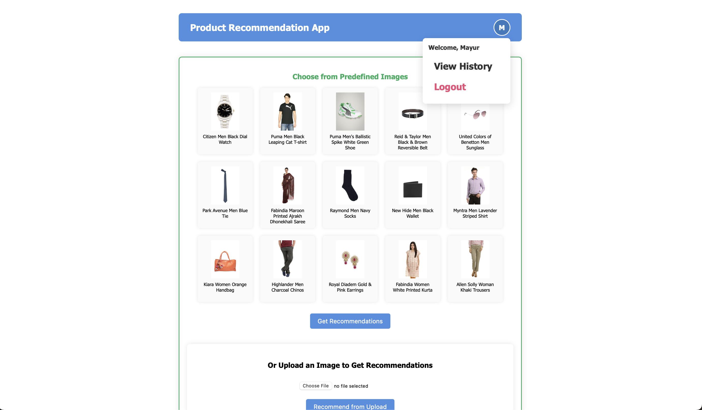
</p>
<h3>View History (Existing User)</h3>
Existing users can click on the History section to view all past uploads and the related recommendations
<p align="center">
  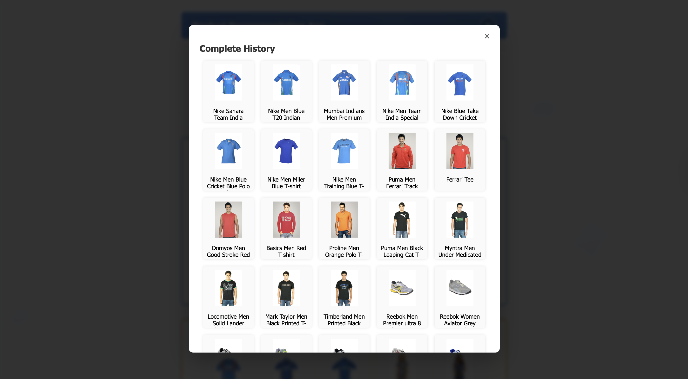
</p>
<h3>View History (New User)</h3>
For new users, the History section will be empty until they upload an image and receive recommendations.
<p align="center">
  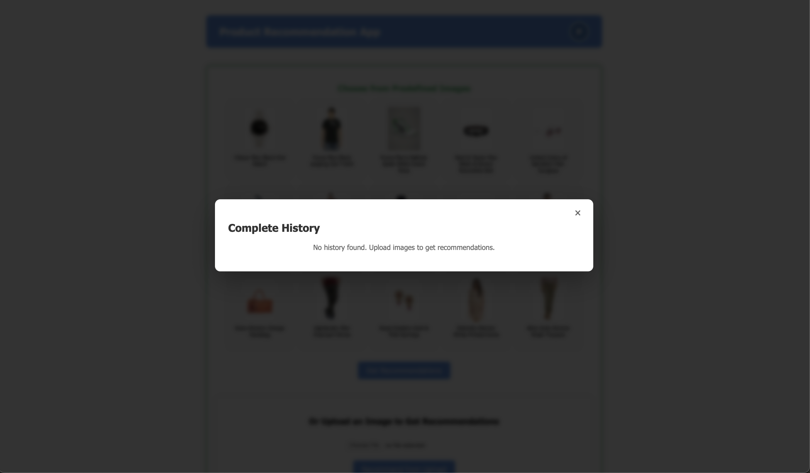
</p>

## Contact 
E-mail: jadhavmayur2035@gmail.com\
LinkedIn: https://www.linkedin.com/in/mayurjadhav24/
