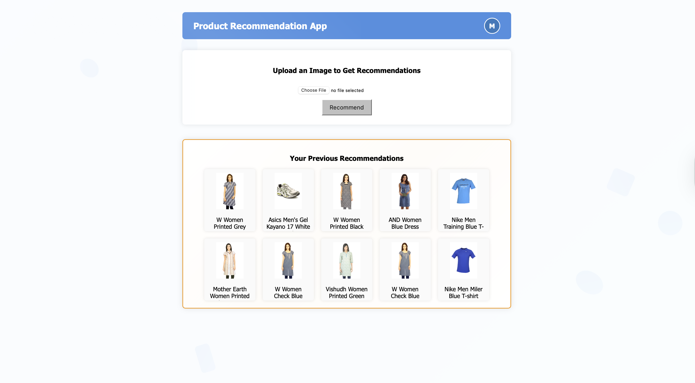

# JTP Technical Project - Product Recommendation System

## Table of Contents

- [Overview](#overview)
- [Dataset](#dataset)
- [Technology Stack](#technology-stack)
- [Approaches](#approaches)
- [Workflow](#workflow)
- [Train](#train)
- [Launch Instructions](#launch-instructions)
- [Screenshots](#screenshots)

## Overview

In everyday e-commerce applications, users receive product recommendations based on their activity and browsing history. Inspired by this, the project aims to develop a product recommendation system that suggests visually similar products based on an uploaded image. Using machine learning techniques such as image feature extraction and similarity matching, the system offers a personalized and intuitive shopping experience. It also tracks previous recommendations, making it easy for users to revisit or continue their search.

## Dataset

This system is trained on a dataset sourced from Kaggle, consisting of 44,000 images. The dataset is accessible here: [Fashion Product Images Dataset](https://www.kaggle.com/datasets/paramaggarwal/fashion-product-images-dataset) . The dataset also includes metadata such as product links, names, and multiple category labels, serving as the foundation for training the model.

## Technology Stack

### Frontend:

- **React.js**: For building the user interface.
- **Axios**: For making HTTP requests from the frontend to the backend.
- **CORS**: Configured to allow secure communication between the frontend and the backend.
- **Framer Motion**: For adding smooth animations and transitions to the UI.
- **React Router DOM**: For handling dynamic routing in the React application.

### Backend:

- **Flask**: A Lightweight Python framework used for building the API.
- **TensorFlow / Keras**: For training the autoencoder model used in feature extraction.
- **Cosine Similarity**: Used to compute similarity between feature vectors.

### Database:

- **MongoDB Atlas**: Cloud-hosted NoSQL database to store user data and recommendation history.

### Deployment:

- **Docker**: For containerizing the application to ensure smooth deployment across environments.

## Approaches

[View approaches](./assets/AUTOENCODER.md)

## Workflow

<p align="center">
  
</p>

[Read further](./assets/FLOWCHART.md)

## Train

> Note: Make sure to download the [dataset](https://www.kaggle.com/datasets/paramaggarwal/fashion-product-images-dataset) and update the file paths to avoid errors and ensure correctness. Install the [requirements](backend/requirements.txt) to run the notebooks.

1. **Dataset Preparation**:\
   Utilize the [preprocessing.ipynb](preprocessing.ipynb) notebook handles dataset preparation by cleaning and filtering the metadata CSV, performing stratified splitting into train and test sets, and copying the corresponding images into separate folders for training and testing.
2. **Training**:\
   The [model_training.ipynb](model_training.ipynb) notebook trains an autoencoder on the image dataset by constructing encoder-decoder networks, feeding images through generators, saving the trained model, and plotting the training loss.
3. **Feature Extraction**:\
   The [feature_extraction.py](feature_extraction.py) script loads the trained autoencoder model, extracts image features by encoding resized images, and saves the extracted features along with metadata into a CSV file.
4. **Pushing Features into Database**:\
   The [db_push.py](backend/db_push.py) script reads the feature CSV and inserts the data into a MongoDB collection using the connection URI stored in .env file.
5. **Test Model**:\
   The [test_model.ipynb](test_model.ipynb) notebook loads the trained encoder model, preprocesses an input image, computes its feature vector, then compares it with pre-extracted features from a CSV using cosine similarity to recommend and display the top similar products

> Connect to MongoDB Atlas, update the network access settings, and copy the connection string. Store the connection string in a .env file to ensure seamless backend execution.

## Launch Instructions

> **Prerequisites:** Docker installed on your machine, and a basic understanding of Docker and terminal commands.

### 1. Repository Cloning: Execute the following command to clone the repository.

```bash
git clone -b main https://github.com/MayurJadhav13/JTP-Technical-Project
```

### 2. Application Startup

Navigate to the project directory:

```bash
cd JTP-Technical-Project/
```

Launch the application by loading the saved model and embeddings with Docker:

```bash
docker-compose up --build
```
or
```bash
docker compose up --build
```
### Access Points:

- **Frontend**: The application can be accessed at http://localhost:3000
- **Backend**: The Flask backend, serving the React frontend, is available at http://localhost:5000

> ⚠️ Database Configuration: The .env file for connecting to MongoDB Atlas has not been uploaded for security reasons. Please contact the repository owner or train the model yourself and push the features to the database as outlined in the [train section](#train).

## Screenshots

<h3>Signup Page</h3>
<p align="center">
  
</p>
<h3>Login Page</h3>
<p align="center">
  
</p>
<h3>Home screen (New User)</h3>
<p align="center">
  
</p>
<h3>Home screen (Existing User)</h3>
<p align="center">
  
</p>
<h3>Get Recommendations</h3>
<p align="center">
  
</p>
<h3>View the product</h3>
<p align="center">
  
</p>
<h3>User Profile</h3>
<p align="center">
  
</p>
<h3>View History (Existing User)</h3>
<p align="center">
  
</p>
<h3>View History (New User)</h3>
<p align="center">
  
</p>
