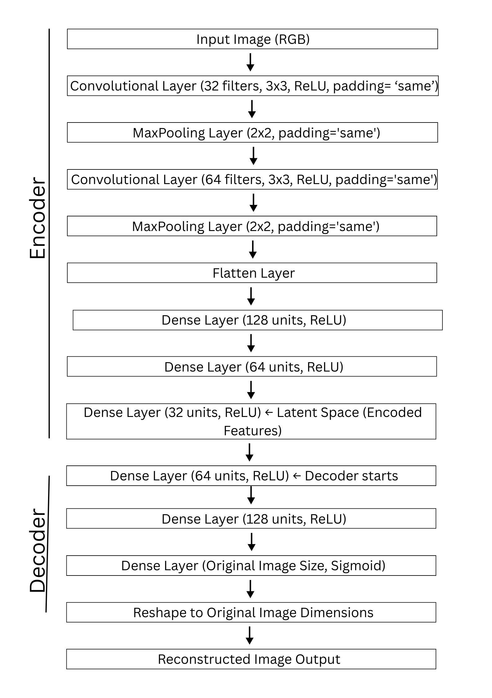

# Product Recommendation System Using Autoencoders
## Approach 01: Using Convolutional Neural Networks (CNNs)
CNNs are well-known for their ability to extract key image features such as edges, shapes, and textures. However, in this project, the dataset is unlabeled, placing the task under the unsupervised learning domain. Traditional CNNs tend to emphasize color and texture, which led to the system recommending products primarily based on color similarity. For instance, it might suggest a red shoe for a red t-shirt image, a visually similar but semantically irrelevant match, making CNNs less ideal for product matching in this context.
## Approach 02: Using Autoencoders
### What Are Autoencoders?
Autoencoders are a type of artificial neural network used to learn efficient representations of input data, typically for the purpose of dimensionality reduction or feature learning. They consist of two main parts:
- **Encoder**: Compresses the input into a low-dimensional latent space.
- **Decoder**: Reconstructs the input from the latent representation.
### Why Use Autoencoders?

- **Effective Feature Compression**: Autoencoders reduce high-dimensional image data into a compact latent space, capturing essential structural features while minimizing the influence of noise and irrelevant details like dominant colors.
- **Unsupervised Learning**: As they don’t require labeled data, autoencoders are ideal for this project, where the objective is to learn meaningful image representations without predefined categories or annotations.
- **Reconstruction-Based Training**: Training focuses on reconstructing the original image from its compressed version, encouraging the model to retain vital visual characteristics. This results in robust, generalizable feature embeddings that are better suited for accurate similarity matching.

The above reasons collectively make autoencoders well-suited for this product recommendation task.

### Model architecture
The model follows a symmetric encoder-decoder structure:

  

### Training Pipeline Step-by-Step
**1. Input**:
- The input is an RGB image, say a blue sports shoe.
- The pixel values are normalized to the range [0, 1] for stable training.
  
**2. Encoding (Feature Compression)**:
- The encoder consists of convolutional and pooling layers that reduce the image size while extracting spatial hierarchies (like edges → shapes → structures).
- For the blue shoe, this might include:
  - Toe shape
  - Laces pattern
  - Sole structure
- These are compressed into a latent vector (e.g., 32 values) that represents the most important features of the shoe, not the color only but its structure and shape.
  
**3. Latent Space (Feature Representation)**:
- This 32-dimensional vector now acts as a semantic signature of the image.
- Think of it as:

  [rounded_toe, low_ankle, rubber_sole, lace_type_X, ...]
- These features are not labeled explicitly, but the network learns them implicitly because they help in reconstructing the original image.
  
**4. Decoding (Reconstruction)**:
- The decoder expands this latent vector back into the full-size image.
- It tries to reproduce the original shoe from just those 32 learned features.
  
**5. Loss Calculation (Reconstruction Loss)**:
- The difference between the original and reconstructed image is calculated using a loss function like Binary Crossentropy or Mean Squared Error.
- For example, if the original shoe has clear laces and the reconstructed one blurs them, the error increases, forcing the encoder to learn better structural features.
  
**6. Backpropagation & Optimization**:
- The model uses Adam optimizer to update weights based on the loss, improving feature learning over each epoch.
 
## Database: MongoDB Atlas

Initially, features were saved using SQL due to its simplicity. However, SQL databases are typically locally hosted, making them inaccessible from other machines.  To ensure the system works on any laptop and supports remote access, MongoDB Atlas was chosen because:

- It is cloud-based, allowing data access from anywhere.
- Offers a free tier, suitable for development use.
- Its schema-less nature fits well with dynamic feature outputs.
- Native support for Python (via PyMongo) and better compatibility with machine learning pipelines.
- High performance and scalability, especially for read/write-heavy ML workloads.

## Frontend: React.js

For building the user interface, React.js was chosen over other frontend frameworks like Angular or Vue because:

- It offers a component-based structure, making the UI modular, reusable, and easier to manage.

- Lightweight and fast, suitable for building responsive and interactive interfaces.

- Strong community support and rich ecosystem of libraries for integration.

- Easier to learn and implement, especially for projects focused more on functionality than heavy UI logic.

- Works well with backend APIs and is widely used in modern full-stack applications.
